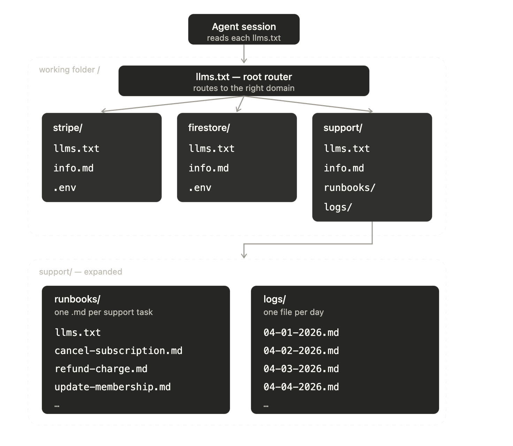

# gcontext

**Version-controlled context modules your AI agent navigates itself.**

[](https://pypi.org/project/gcontext-ai/)
[](LICENSE)
[](https://pypi.org/project/gcontext-ai/)

Give your agent a folder of plain markdown it navigates on its own. A root `llms.txt` indexes one module per domain (your Stripe account, your database, your support runbooks); each module has its own `llms.txt`, notes, and `.env`. The agent starts at the root index, follows only the links it needs, and acts: queries the database, calls the Stripe API, resolves the ticket. Only the index is loaded up front, and unused modules cost nothing. Works with Claude Code, Cursor, Codex, or anything that reads files. No account, no server, no embeddings: just files in git.




## How to use it

Install and create the workspace:

```bash
curl -LsSf https://gcontext.ai/gcontext/install.sh | sh   # or: uv tool install gcontext-ai
gcontext init
```

Put your keys in `.env` (module files only ever name the variables; the values stay gitignored):

```bash
STRIPE_SECRET_KEY=sk_...
```

Open your agent in the workspace and ask it to build a module:

```
Create a stripe integration module from our account and load it.
The key is in .env as STRIPE_SECRET_KEY.
```

The agent writes `info.md`, an `llms.txt` index, and a `module.yaml` that declares the secret by name only. From then on a fresh session can answer real questions ("how many active subscriptions does this gym have?") by following the index to the module and calling the API with the key from `.env`.


## Why we built it

We run [MAAT](https://maatapp.com), membership software for martial arts gyms, on Stripe and Firestore. As we grew, support work piled up: subscription problems, membership edits, data exports. Three stages got us here:

1. **By hand through the AI.** We updated Stripe and the database manually, one ticket at a time. It worked, but it was slow and tedious.
2. **One big CLAUDE.md.** We described the backend and how Stripe data maps to Firestore. Diagnosing errors got much faster, but everything lived in a single file and we still didn't trust the AI to touch production.
3. **A tree of `llms.txt`.** Now the agent is steered, one link at a time, to exactly the right place (the diagram above). It gets the process right, and every new kind of ticket becomes a runbook it reuses next time.

## Commands

Run these with the CLI:

| Command | What it does |
|---------|-------------|
| `gcontext init` | Create a new workspace |
| `gcontext load <name> [...]` | Activate modules in the workspace |
| `gcontext unload <name>` | Deactivate a module |
| `gcontext env` | Check required secrets are set |
| `gcontext validate [name]` | Verify module structure |

The rest the agent does for you from plain language, just ask:

| Just ask the agent | Equivalent CLI |
|---------|-------------|
| "Create a stripe integration module" | `gcontext new <kind> <name> [summary]` |
| "Which modules do we have?" | `gcontext ls` |

---

Built by [Bleak AI](https://bleakai.com) | [gcontext.ai](https://gcontext.ai)
