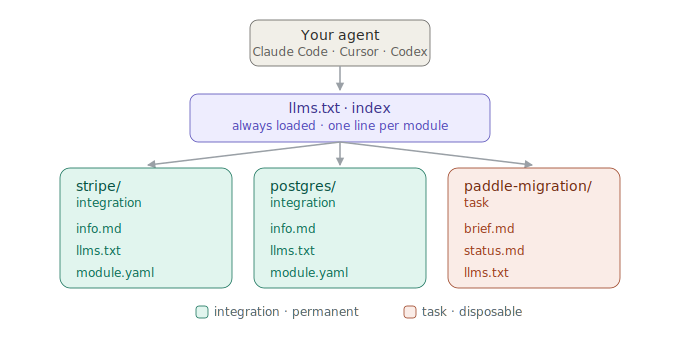

# gcontext

**Version-controlled context modules your AI agent navigates itself.**

[](https://pypi.org/project/gcontext-ai/)
[](LICENSE)
[](https://pypi.org/project/gcontext-ai/)

Your agent's knowledge and its working state live as plain markdown in git: modular, reviewable, loaded per task. Modules carry the credentials and the know-how for the agent to **act** (query the database, hit the Stripe API, run the deploy), and work in flight **survives the session**: start a migration today, get blocked, come back Thursday and say "continue".


*A real session, replayed: one prompt builds a Supabase integration, then a fresh session answers "how many users do we have?" with the live number. [Unedited transcript](https://gcontext.ai/first-session.html) · [Do it yourself in three copy-pastes](examples/first-integration.md)*

Works with Claude Code, Cursor, Codex, and anything else that reads files. No account, no server, no new runtime, no embeddings: your keys stay in your local `.env`, modules are just files in your repo, and the agent navigates them like a file tree.

**Jump to:** [Quick start](#quick-start) · [How it works](#how-it-works-navigation-not-retrieval) · [Module kinds](#module-kinds) · [See it in action](#see-it-in-action) · [FAQ](#faq) · [Commands](#commands)

---

## The problem

AI agents fail for the same reason large codebases fail: **implicit state.** Prompts become undocumented architecture, instructions drift between conversations, and the work in flight (the migration you started Monday, the blocker you're waiting on) lives only in your head, so every session starts with a re-briefing. gcontext treats context as infrastructure: files in git, with the same review loop as code.

**Without structured context:** giant system prompts nobody maintains, "remember, our Stripe webhook is at..." every session, you as the project manager re-briefing your agent on where every piece of work stands.

**With gcontext:**

```
modules-repo/
  stripe/            → API keys, webhooks, how to query invoices
  postgres/          → schema, migrations, connection details
  deploy-pipeline/   → step-by-step release to production
  migrate-to-paddle/ → task: where it stands, what's blocked, what's next
```

Each module is a self-contained unit of context. Load what the task needs, unload what it doesn't. Nothing else enters the window.

## Quick start

Three copy-pastes: one command, two lines in `.env`, one prompt. Your agent does the rest.

### 1. Install and initialize

```bash
curl -LsSf https://gcontext.ai/gcontext/install.sh | sh   # or: uv tool install gcontext-ai
gcontext init
```

The only command you have to run. It creates the workspace your agent operates from (and never overwrites an existing one):

```
AGENTS.md            # auto-loaded by your agent; points it at context/system.md
CLAUDE.md            # one line: @AGENTS.md (Claude Code reads this file)
context/             # what the agent reads: generated llms.txt index + loaded modules
modules-repo/        # source of truth: your modules
```

### 2. Put a key in `.env`

```bash
SUPABASE_URL=https://your-project.supabase.co
SUPABASE_SECRET_KEY=sb_secret_...
```

Module files only ever name the variables. The values stay in the gitignored `.env`. Prefer read-only credentials where the service offers them.

### 3. Say the prompt

Open your agent (Claude Code, Cursor, Codex) in the workspace and ask for what you have:

```
Create a supabase integration module for our Supabase project and load it
into the workspace. The keys are in .env as SUPABASE_URL and SUPABASE_SECRET_KEY.
```

The agent builds and loads the module itself: `info.md` with the API know-how, `llms.txt` as the index, `module.yaml` declaring the secrets by name only.

Starting from zero instead? Say `Set up gcontext for this project` and the agent interviews you, then builds your first modules from the answers.

### 4. Ask a real question in a fresh session

```
How many users do we have?
```

A new conversation that has never seen your project follows the index to the module, calls the API with the key from `.env`, and answers with the live row count.

### 5. Hand it the work in flight

```
We're migrating auth to OAuth. Track it as a task.
```

The agent creates a task module (`brief.md` for the goal, `status.md` for progress and blockers) and keeps it current as it works. Days later, in a fresh conversation, "continue the oauth migration" is all the briefing it needs.

---

**This quick start is tested.** The step 3 prompt is run against a real model before every release ([walkthrough](examples/first-integration.md), [full unedited transcript](https://gcontext.ai/first-session.html)); if it stops working, the release does not ship. Prefer doing things by hand? Every step is also a deterministic command: see [Commands](#commands).

## How it works: navigation, not retrieval

Modules are independent units of knowledge: an API integration, a deployment procedure, a bounded piece of work. Each contains plain markdown and a navigation index (`llms.txt`) the agent uses to find what it needs.



Only the index (one line per module) is always in context. Detail enters the window when the agent follows a link, fresh at the moment the task needs it. Unloaded modules cost zero tokens.

The mechanics are deliberately boring: `gcontext load postgres` creates a symlink `context/postgres → modules-repo/postgres` and regenerates the root index; `unload` removes the link. No copies, no database, no daemon: you can inspect every byte the agent could read by opening a folder.

## Module kinds

Two kinds carry a workspace: what your agent **knows**, and what it's **working on**. The agent picks the kind when it creates a module; this table is for reading what it made.

| Kind | What it captures | Lifecycle | Example |
|------|-----------------|-----------|---------|
| **Integration** | How to use an external service, API, or database | Permanent: lives as long as the service does | Stripe, Postgres, GitHub, Slack |
| **Task** | A bounded piece of work and where it stands | Disposable: done when the work is done | Fix billing bug, migrate auth, ship feature X |

## See it in action

<details>
<summary><strong>An integration module makes real calls, no MCP server needed</strong></summary>

An integration module is three things: what the service is (`info.md`), how to navigate it (`llms.txt`), and which secret it needs (`module.yaml`, name only). That is everything an agent needs to act:

```
$ claude → "Refund the duplicate charge for customer@acme.com"

Reads stripe/info.md → knows refunds need the charge id, not the intent
Looks up the customer, finds two charges 41s apart
Refunds ch_3Oa2... ($49.00), refund re_3Oa2... succeeded
```

MCP gives agents tools; for most of your stack, a markdown file plus an env var does the same job, and you can `git diff` it. (This exchange is illustrative; for a real one, unedited, see [the recorded session](https://gcontext.ai/first-session.html).)

</details>

<details>
<summary><strong>A task module survives the week, not just the session</strong></summary>

```
Monday    $ claude → "Start the Stripe-to-Paddle migration"

          Creates modules-repo/paddle-migration/ (a task module)
          Maps price ids, exports products... blocked: Paddle support
          must enable the sandbox. Writes the blocker to status.md.

Thursday  $ claude → "Any movement on the migration?"

          Reads paddle-migration/status.md
          "Blocked on Paddle support since Monday (ticket #4821).
           Price mapping is done. Next: webhook rewrite, once
           sandbox access lands."
```

The task module is the state: what's done, what's blocked, what's next. When the work ships, delete it, or keep it as the record of what happened.

</details>

<details>
<summary><strong>Example workspaces</strong></summary>

**Software engineering team**

```
modules-repo/
  postgres/          → schema, connection, query patterns
  github/            → repo structure, PR conventions, CI
  deploy-pipeline/   → release steps, rollback procedures
  fix-billing-bug/   → task: reproduce, investigate, fix, verify
```

**Support automation**

```
modules-repo/
  zendesk/           → API access, ticket categories, macros
  stripe/            → subscription lookup, refund procedures
  knowledge-base/    → product docs, known issues, FAQ
  escalation/        → when and how to escalate
```

**Claude Code / Cursor setup**

```
modules-repo/
  codebase/          → architecture, conventions, key paths
  cloudflare/        → DNS, workers, deployment targets
  monitoring/        → Grafana dashboards, alert rules
  ship-v2-auth/      → task: migrate auth with progress tracking
```

</details>

<details>
<summary><strong>Onboarding your team</strong></summary>

A colleague joining an existing workspace has nothing to set up and nothing to learn:

```bash
git clone <your-repo> && cd <your-repo>
cp .env.example .env    # fill in your own credentials (gcontext env shows what's missing)
claude                  # or cursor, codex; the workspace tells the agent the rest
```

Their agent reads the same modules yours does: the schema notes, the deploy runbook, the gotchas your team already paid to learn. And nobody hand-maintains it: the agent updates modules as a side effect of doing work (it fixed a deploy quirk, it writes the quirk down), and the humans review the diffs in PRs like any other change. If a module goes stale, `git blame` tells you when and why.

</details>

## FAQ

<details>
<summary><strong>Isn't this just AGENTS.md / CLAUDE.md with extra steps?</strong></summary>

A flat instructions file (including Claude Code's `@imports`, which inline everything at session start) puts the whole thing in the window every session, and quality degrades as it grows. gcontext keeps the always-loaded part tiny and everything else behind links the agent follows on demand. The honest answer to "couldn't I hand-roll this with a docs/ folder?" is: yes, partially; gcontext is that convention made consistent and cheap. The tooling adds what a convention can't enforce: load/unload per task, the regenerated index, module kinds with different lifecycles, secrets declared by name and checked with `gcontext env`, and `gcontext validate` to catch broken links. And because it's a shared convention rather than your house style, the same workspace works identically across Claude Code, Cursor, and Codex.

</details>

<details>
<summary><strong>Don't agents just ignore context files anyway?</strong></summary>

Instructions buried in a long monolithic prompt do decay; that's an argument *against* flat files, not against structure. You can't force a model to read anything; what you can do is keep the always-loaded part small and make the relevant file one link away, so it's read fresh at the moment the task touches it.

</details>

<details>
<summary><strong>Isn't maintaining a folder of markdown a chore? Wikis die this way.</strong></summary>

Wikis die because humans must maintain them on the side. Here the agent maintains the modules as a side effect of doing work, and the human's job shrinks to reviewing diffs. That review step is the point: it's the same control you already have over code the agent writes.

</details>

<details>
<summary><strong>Is this the llms.txt web standard?</strong></summary>

Same filename, different job. The web proposal puts an index on public websites for crawlers. gcontext uses the same index *shape* inside your private repo, purely for your own agent at inference time. Nothing is published or exposed.

</details>

<details>
<summary><strong>What does this cost in tokens?</strong></summary>

The index is a few hundred tokens. Module detail enters the window only when navigated to. Unloaded modules: zero.

</details>

<details>
<summary><strong>Won't better models make this unnecessary?</strong></summary>

Better models still won't know your schema, your conventions, or the runbook you wrote last week. That knowledge has to live somewhere. gcontext's position is that it should live in git, where you can diff it, review it, and blame it.

</details>

<details>
<summary><strong>Why the filesystem and not a vector database / memory layer?</strong></summary>

| | Filesystem (gcontext) | Vector DB / Memory |
|---|---|---|
| **Version control** | `git diff`, `git blame`, full history | Requires custom versioning |
| **Inspectability** | Open a folder, read the files | Query an API, decode embeddings |
| **Determinism** | Same files = same available context | Similarity search varies |
| **Human readability** | It's markdown | It's vectors |
| **Composability** | Load/unload modules like imports | Rebuild index on every change |
| **Tooling** | Works with every editor, CI, linter | Needs specialized tooling |
| **Portability** | Copy the folder | Export, migrate, re-index |

And what gcontext is *not*: a vector database (no embeddings, the agent navigates a file tree), a memory model (context is explicit and human-curated), a replacement for RAG (complementary), or an agent framework (no runtime, works with the agent you already use).

</details>

## Commands

| Command | What it does |
|---------|-------------|
| `gcontext init` | Create a new workspace (errors if one already exists) |
| `gcontext new <kind> <name> [summary]` | Scaffold a module |
| `gcontext load <name> [...]` | Activate modules in the workspace |
| `gcontext unload <name>` | Deactivate a module |
| `gcontext ls` | List all modules and their status |
| `gcontext env` | Check if required secrets are set |
| `gcontext validate [name]` | Verify module structure |

## Works with

gcontext produces plain markdown with a navigable index. Any agent that reads files can use it. We use it daily with **Claude Code** (via the generated `CLAUDE.md` → `AGENTS.md`), **Cursor**, **Codex**, and **pi.dev**.

## Status

Current release: **v0.2.4**, early, small, and functional. The CLI surface is complete and covered by tests; the module format may still evolve before 1.0. The CLI is MIT and standalone. An optional hosted version with a web UI and built-in chat ([gcontext Cloud](https://gcontext.ai/how-it-works)) is in the works; the CLI does not depend on it.

---

Built by [Bleak AI](https://bleakai.com) | [gcontext.ai](https://gcontext.ai)
